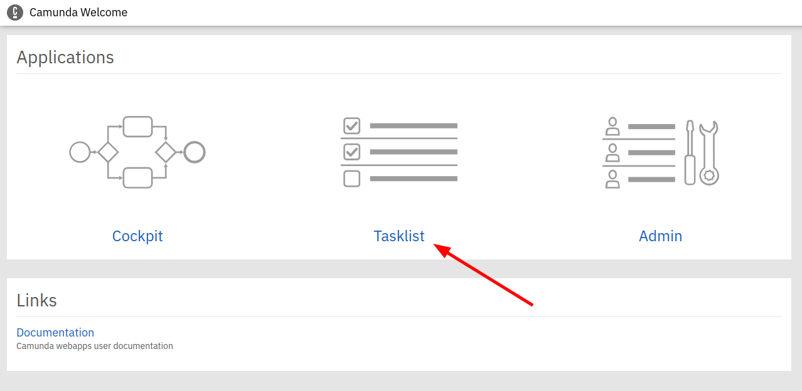
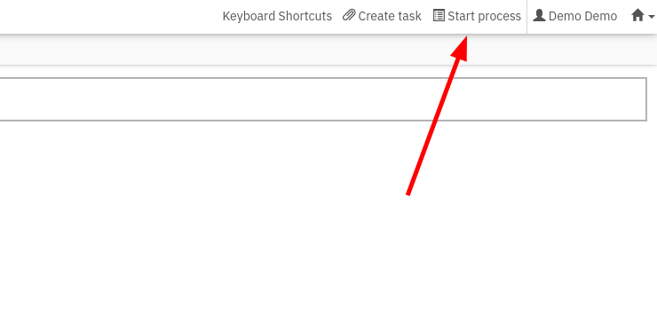
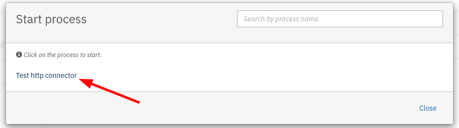
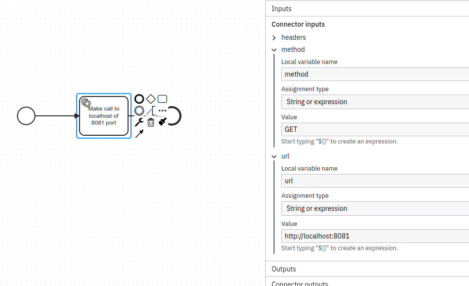

# Camunda Server

## Start process

Sample camunda server to show how http connector is working. When it starts it serves 8080 port and manages Camunda cockpit.

To login into Cockpit use:
```
username: demo
password: demo
```

To start sample process go to Task List



And then select Start Process



Select test-http-connector process




## Process definition

Project includes sample process (test-http-connector.bpmn) it has a connector task.




## Connector dependencies 

To use a connector you need following dependencies to be included into maven:

```xml
    <dependency>
      <groupId>org.camunda.connect</groupId>
      <artifactId>camunda-connect-core</artifactId>
    </dependency>
    <dependency>
      <groupId>org.camunda.connect</groupId>
      <artifactId>camunda-connect-connectors-all</artifactId>
    </dependency>
    <dependency>
      <groupId>org.camunda.bpm</groupId>
      <artifactId>camunda-engine-plugin-connect</artifactId>
    </dependency>
```

